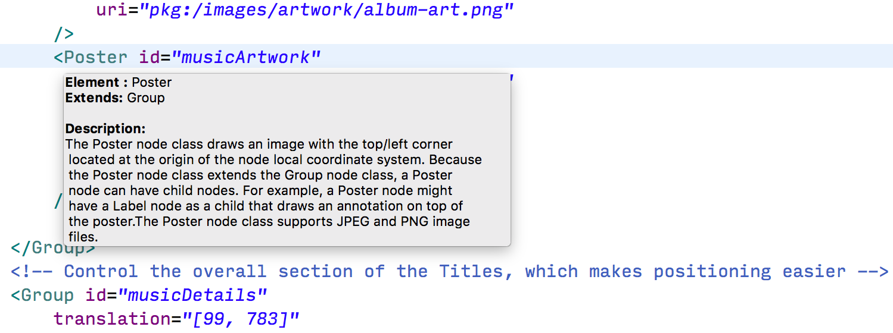
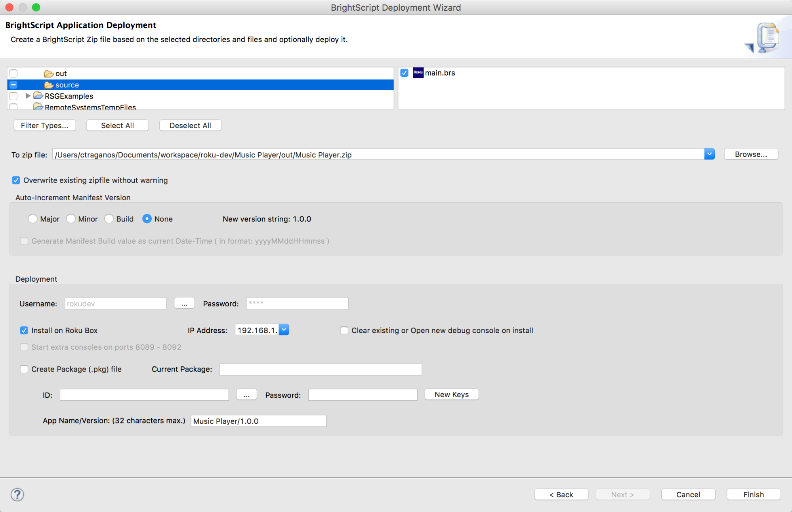

# Roku Plugin for Eclipse IDE

_Speed up the development, testing, and publishing for channels_

## Overview
With over 80,000 developers on the platform, we have been working to improve the experience of building channels on the Roku Platform. Today, we’re excited to share an open beta for the revamped Roku plugin for Eclipse!

[The Eclipse IDE (Integrated Development Environment)](https://eclipse.org/ide/) is used by millions of professional engineers around the world for coding and deploying rich applications.

## Why the Roku plugin is great?

Building channel applications requires several items to work together in unison:

*   A Roku device
*   The Roku Operating System
*   Your channel application
*   Hosted media content (video, audio, games, etc)

To make this happen, developers set up various ways to get rapid coding installed quickly on a device. Thanks to the Roku Plugin for Eclipse, within several minutes you’ll have the power of a fully baked Integrated Development Environment and the customizations needed to develop, test, package, and install channels on Roku devices.

### Key Features

### Code highlight / Syntax Coloring

Quickly find errors in your channel application with our built in color coding for BrightScript and Roku SceneGraph syntax.

### Code completion and hints
The plugin checks the reference guides for BrightScript and Roku SceneGraph, allowing for auto completion and details for parameters, methods, and nodes.

### Built in telnet console for BrightScript and SceneGraph
All the available Roku device telnet ports are built into the plugin, allows for fast feedback on bugs, stack traces, and break points in your channel application.

## Create a new BrightScript project
Quickly have all required assets and files setup through Eclipse. In addition, reference sample channels are provided in a simple drop down for testing. The manifest, components, source, images, locale, and related directories are handled instantly.

### Installing and packaging channel application
Using the standard export option for projects, the Roku plugin for Eclipse enables developers to install their current channel code onto Roku devices within seconds. In addition, developers can package and key their applications for preparing the Channel Store required assets.

## Installation Steps:
> :information_source: Note: Make sure any previous versions of the Roku plugin for Eclipse are uninstalled via Eclipse &gt; Help &gt; Installation Details &gt; BrightScript core &gt; Uninstall.
>
> In addition the minimum required version of Eclipse is the “Mars” release.

> :information_source: Workspace: We encourage you to start your Roku projects in a fresh workspace. You can copy your projects back in afterwards. Thanks!

1.  Download Java version 8: [oracle.com/technetwork/java/javase/downloads/jre8-downloads-2133155.html](http://www.oracle.com/technetwork/java/javase/downloads/jre8-downloads-2133155.html)
2.  Download the latest version of the Eclipse Installer _(currently version “Mars”)_ for Java IDE Developers: [eclipse.org/downloads/installer-instructions.php](https://eclipse.org/downloads/installer-instructions.php)
3.  Add the Roku Plugin package via Eclipse > Help > Install New Software > Add...
    *   Name: Roku Plugin
    *   Location: [https://devtools.web.roku.com/ide/eclipse/plugin](https://devtools.web.roku.com/ide/eclipse/plugin)
    *   Follow the instructions and click Next... then Finish

## Note: Updated version available!

We've released an updated version of the Roku Eclipse plugin following the release of OS 7.2 to patch bugs and regressions. Developers who installed the Eclipse plugin prior to August 1, 2016 should update the plugin by clicking Eclipse &gt; Help &gt; Install New Software &gt; Add...

*   Name: Roku Plugin
*   Location: [https://devtools.web.roku.com/ide/eclipse/plugin](https://devtools.web.roku.com/ide/eclipse/plugin)
*   Follow the instructions and click Next.
*   You'll receive a message saying that "'BrightScript Core'" is already installed, so an update will be performed instead." Click Finish.
*   Restart Eclipse.

**Related resources:**

*   [http://www.eclipse.org/downloads/](http://www.eclipse.org/downloads/)
*   [https://devtools.web.roku.com/ide/eclipse/plugin](https://devtools.web.roku.com/ide/eclipse/plugin)
*   [https://sdkdocs.roku.com/display/sdkdoc/Roku+SDK+Documentation](https://sdkdocs.roku.com/display/sdkdoc/Roku+SDK+Documentation)
