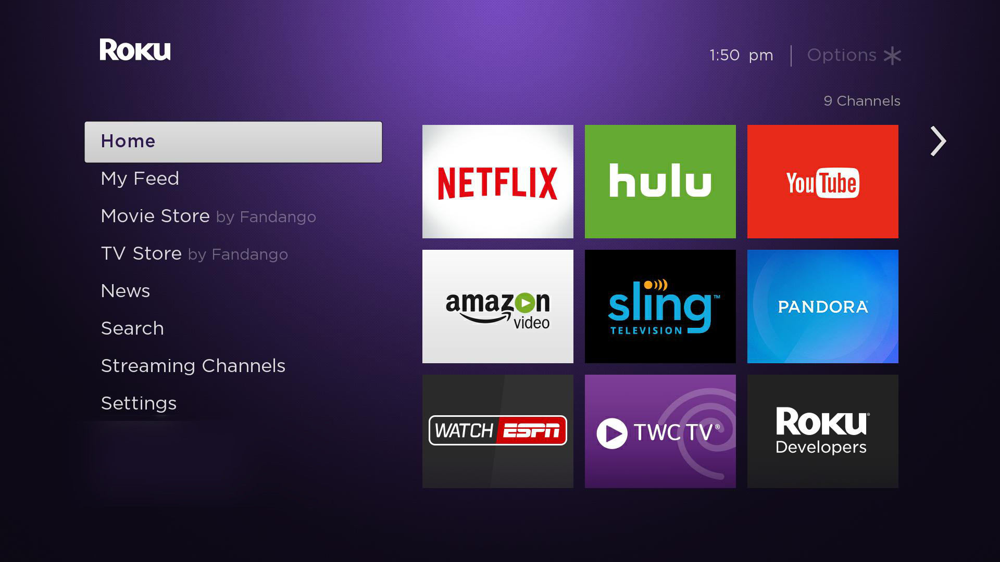
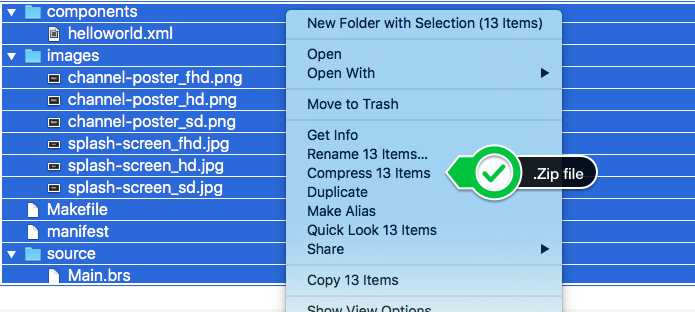

# Hello World

_How to load a sample channel application on your Roku device_


### Overview

In this guide, we will cover the essential steps for testing a ‘Hello World’ sample channel application on your Roku device.

**Steps:**

1. Review the [Developer Setup Guide](https://blog.roku.com/developer/2016/02/04/developer-setup-guide/)
2. Open the Developer Application Installer
3. [Download](https://github.com/rokudev/hello-world/raw/master/dist/apps/hello-world.zip) and Install the Sample Channel Application
4. Edit the Sample channel Application
5. Re-upload Sample Channel onto a Roku device

**Requirements to follow this guide:**

* A Roku device: [roku.com/products/compare](https://www.roku.com/products/compare)
* A Roku account: [my.roku.com/signup](https://my.roku.com/signup)
* Download the sample channel app: [hello-world.zip](https://github.com/rokudev/hello-world/raw/master/dist/apps/hello-world.zip)

- - -


## 1\. Review the [Developer Setup Guide](https://blog.roku.com/developer/2016/02/04/developer-setup-guide/)

The Roku Developer Setup guide enables any Roku device to install sample applications such as the basic hello world example in this guide.

**Developer Settings**         |  **Development Application Installer**
:-------------------------:|:-------------------------:
 |  


[Follow the Developer Setup Guide >](/develop/getting-started/setup-guide.md)

## 2\. Open the Development Application Installer

After completing the steps covered in the [Developer Setup guide](/develop/getting-started/setup-guide.md), open a web browser and navigate to the Roku device URL _(i.e._ [_http://192.168.x.x_](http://192.168.x.x)_)_

**_Note:_** _To connect your Roku device, make sure your computer and Roku are on the same local network._


**Roku device credentials**
When you navigate to your Roku device, it will prompt for a **user name** (typically ‘rokudev’) and password was set during the Device Setup guide. Enter this information to continue.

**Once the page successfully opens, you have successfully connected to the Roku device.**

The primary screen will show the development application installer:


**_Related guide:_**
[_How to update the software on a Roku device_](https://support.roku.com/hc/en-us/articles/208755668-How-can-I-update-the-software-on-my-Roku-player-\)

## 3\. Download and Install the Sample Channel Application

Now that you have enabled **Developer Mode** on your Roku device and logged in, we can continue with downloading and opening a Sample Channel Application.

**Download the sample application located at:** [github.com/rokudev/hello-world/raw/master/dist/apps/hello-world.zip ](https://github.com/rokudev/hello-world/raw/master/dist/apps/hello-world.zip)

Once downloaded, take the .zip application and upload it to your Roku device using the Developer Application Installer:


To finish this process, click on the **Install** button located below the upload option. If the sample channel contains no errors and the process runs successfully, the sample channel will launch on the Roku device:


**Note:** Roku devices in “Developer Mode” will allow one “side-loaded” channel at a time. If you run this process again, the new channel upload will replace the existing channel.

**Finding your Sample Channel on the Roku Device**
The developer channel will be automatically placed in the bottom row of your main channels, also known as “My Channels”.



## 4\. Editing the Sample Application

When you uncompress the .zip directory, you’ll see the following setup:


**Here’s a breakdown of the common items inside the sample application:** 
For this example, you will open the [helloworld.xml](https://github.com/rokudev/hello-world/blob/master/source/components/helloworld.xml#L5) file that is located inside the components directory.

### **helloworld.xml**

``` xml
<?xml version="1.0" encoding="utf-8" ?>
<component name="HelloWorld" extends="Scene">
	<children>
      <Label id="myLabel"
      	text="Hello World!"
      	width="1280"
      	height="720"
      	horizAlign="center"
      	vertAlign="center"
      	/>
    </children>
</component>
```

The example XML file above shows how a simple Label is created and centered on the screen. Specifically on [**Line 5**](https://github.com/rokudev/hello-world/blob/master/source/components/helloworld.xml#L5), the Label’s value is set with [text="Hello World"](https://github.com/rokudev/hello-world/blob/master/source/components/helloworld.xml#L5).

**_Optional:_ **Review the code for additional attributes that can be set for this sample channel application. Change the value of the text field on line 5 to another phrase: `text="Hello World!"
`

After saving the edits to [helloworld.xml](https://github.com/rokudev/hello-world/blob/master/source/components/helloworld.xml), select all the items inside the directory and zip compress utility on your computer.

### Compressing the contents of the Hello World directory

**Note:** Remember to compress only the contents of the directory, not the parent folder.

**For Example:** If you compress (“zip”) the parent folder, the Developer Application Installer will return an error.


**Here are the proper ways to compress the required files:**

**Mac OS X:** Right click all selected files to compress into a .zip file.



**Windows:** Simply select all the files and folders and right click to compress into a .zip file.


### Re-Upload the Channel Application

Once you have recompressed the Channel application, open a web browser and navigate again to the Roku device URL _(i.e._ _http://192.168.x.x__)_


Upload the .zip file and click **Install**

You will immediately see the edited phrase in your Sample Channel Application:


## 5\. Explore the Developer docs!

Go to the [Channel Development Guide](/develop/channel-development) and explore the methods, parameters, and syntax for building rich and complex channel applications on the Roku platform.

For samples regarding our new XML framework, Roku SceneGraph, go to [Channel Samples Gallery](/develop/guides/examples.md) to get started!
