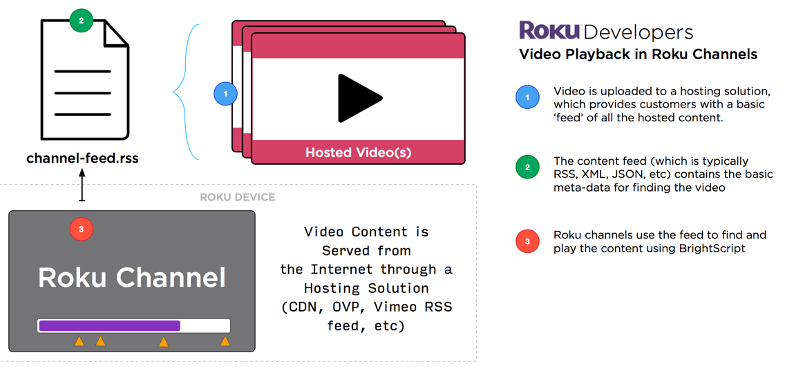

# How Roku Channels Work
_Understand hosting, streaming, and building channels on the Roku Platform_

The Roku platform has thousands of channels, streaming billions of hours of content to our audience per year. As the industry leader in streaming devices and channel offerings, it’s helpful to understand how a Roku channel is developed and distributed to users around the world.

**The 3 main requirements for creating a Roku Channel are:**

- Original and/or licensed video content (content publishers)
- Hosted content available through the Internet (OVP, CDN, etc.)
- Roku Channel App
  - BrightScript application for streaming video playback (developers)
  - Direct Publisher application

**Note that we do not charge developers a fee for creating channels on the Roku platform.** The best step for activating your developer account is by following the [Developer Setup Guide](/develop/getting-started/setup-guide.md).

In this post we'll cover:

- [Content hosting](#content-hosting)
- [Playing hosted videos in Roku Channels](#playing-hosted-videos-in-roku-channels)
- [Creating a Roku Channel App](#creating-a-roku-channel-app)

---

## Content Hosting
Before creating a channel for playing licensed content, an important first step is deciding how and where to host your videos for streaming to the Roku platform. Here are some common solutions:

**OVP (Online Video Platforms):**

- [Zype](http://www.zype.com/)
- [Wistia](http://wistia.com/)
- [Vimeo Pro](https://vimeo.com/pro)
- [Ooyala](http://www.ooyala.com/)
- [Brightcove](https://www.brightcove.com/)
- [Kaltura](http://corp.kaltura.com/)

**CDN (Content Delivery Networks):**

- [Akamai](https://www.akamai.com/)
- [Scale Engine](https://www.scaleengine.com/)
- [Limelight Networks](https://www.limelight.com/)
- [EdgeCast](https://www.verizondigitalmedia.com/)
- [BitGravity](http://www.bitgravity.com/)
- [thePlatform](https://www.theplatform.com/)
- [Amazon Web Services (AWS)](https://aws.amazon.com/)

*
Video Playback in Roku Channels
*

## Playing hosted videos in Roku Channels
Once you have your content uploaded to a hosting solution, the next step is creating and exporting what is a called a **"content feed."** That is typically an **RSS**, **XML**, or **JSON** file, containing detailed information about each video file (file format, bitrate, etc.), and the content itself (title, artwork, etc.).

The video playback flow in a Roku Channel is:

- Video is uploaded to a content hosting solution, which provides customers with a basic "feed" of all the hosted content.
- The content feed (RSS, XML, or JSON file) is added to the channel, containing the metadata for the hosted media (video, audio, etc.):
  - Title
  - Descriptions
  - Keywords/Categories
  - Artwork
  - URLs for downloading media
- Roku channels playback the content. The channel creation can be done in two different ways:
  - Using BrightScript, our scripting language, and SceneGraph, our framework for customizing the design and appearance of channels
  - With [Direct Publisher](https://developer.roku.com/publish)

## Creating a Roku Channel App
You have two options when creating a new Roku channel, depending on the level of customization you need: you can use the **Direct Publisher web app**, or develop a channel using **BrightScript**, which is Roku's **powerful scripting language**.

### Direct Publisher
Direct Publisher is Roku's new web app that allows you to **quickly create a high-quality channel without any coding**. This is a great option if you don't need a deep level of customization, or cannot allocate or outsource development work.

If you're interested in this option, head over to the [Direct Publisher Channel Tutorial](https://developer.roku.com/publish/channel-tutorial) for a quick hands-on tutorial on how to create a sample channel.

*
Direct Publisher - Example Channel
*

### BrightScript
BrightScript is **Roku's powerful scripting language** that lets you build channels for any Roku-powered device. This is the best option when you want **more flexibility** to fully **customize the design and UI** of your channel.

*
BrightScript Channel - Basic Feed Based Channel
*

#### Finding a BrightScript developer
We encourage your development team to review the [Developer SDK Getting Started section](/develop/getting-started) and test out a basic channel building process before seeking a contractor. We have multiple guides describing in more detail how to use BrightScript such as:

- [Building a "Hello World!" Roku Channel](/develop/getting-started/hello-world.md)
- [Guides and Tutorials](/develop/guides)
- [Sample Channels](https://www.github.com/rokudev/sample-channels)
- [Roku Plugin for Eclipse](/develop/developer-tools/eclipse-plugin.md)

We also have a list of [recommended development shops that build Roku channels](https://roku.app.box.com/channel-developer-list).

For smaller contractors, here are some independent developers with reviews on Upwork:

- BrightScript: [upwork.com/o/profiles/browse/?q=brightscript](https://www.upwork.com/o/profiles/browse/?q=brightscript)
- Roku Development: [upwork.com/o/profiles/browse/?q=roku](https://www.upwork.com/o/profiles/browse/?q=roku)
