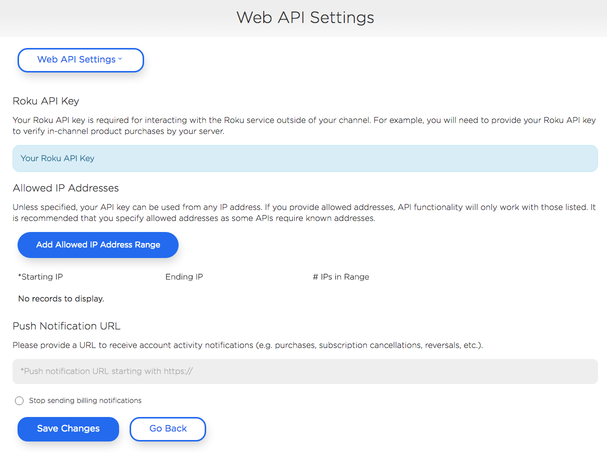

# Roku Web Services

### Overview
Roku Web Services is integral to allow subscribers who signed up on Roku to use your service on other platforms. This API can be used to determine whether a subscription on Roku is still valid so the subscriber can be entitled access on a platform other than Roku. Among other features, this API provides functionality for:
* Canceling subscriptions
* Issuing credits
* Updating billing cycles

**Sections:**
* [Setting up Roku Web Services](#setting-up-roku-web-services)
* [Transaction Service](#transaction-service)
* [Push Notifications](#push-notifications)

---

## Setting up Roku Web Services

All transaction service requests require a `Roku API Key` assigned to each Roku developer. The API key can be retrieved from the Web API Settings page on the Developer Dashboard.

Developers can also set a range of IP addresses transaction service requests can come from. Requests will only be valid if Roku receives it from the range of IP addresses specified. If no range is specified, requests from any IP address using your `Roku API Key` are valid.

Developers can also specify a URL endpoint to receive push notifications for transaction events such as: purchases, cancellations, refunds, and credits.

> :information_source: If the endpoint to receive push notifications fails consecutively, Roku will stop sending notifications and `Stop sending billing notifications` will be checked. When the endpoint is valid and can receive push notifications again, uncheck `Stop sending billing notifications`.



> :information_source: See [Developer Dashboard](/publish/channel-store/developer-dashboard.md) for an overview of available features.

## Transaction Service

These API calls are all located on [https://apipub.roku.com](https://apipub.roku.com/) to remove the need of having a Roku certificate to use them.

### Validate Transaction

Validates a transaction that was returned from a channel or product purchase in the channel store.

**Heading:** /listen/transaction-service.svc/validate-transaction/{rokuAPIKey}/{transactionid}

**Response example:**
```xml
<result>
  <transactionId>{transactionid}</transactionId>
  <purchaseDate>2012-07-22T14:59:50</purchaseDate>
  <channelName>123Video</channelName>
  <productName>123Video Monthly Subscription</productName>
  <productId>NETMONTH</productId>
  <amount>9.99</amount>
  <currency>USD</currency>
  <quantity>1</quantity>
  <rokuCustomerId>abcdefghijklmnop</rokuCustomerId>
  <expirationDate>2012-08-22T14:59:50</expirationDate>
  <originalPurchaseDate>2010-08-22T14:59:50</originalPurchaseDate>
  <status>Success</status>
  <errorMessage>error_message</errorMessage>
</result>
```

### Validate Refund

Validates a transaction that was returned from a channel or product purchase in the channel store.

**Heading:** /listen/transaction-service.svc/validate-refund/{rokuAPIKey}/{refundId}

**Response example:**
```xml
<result>
  <transactionId>{transactionid}</transactionId>
  <purchaseDate>2012-07-22T14:59:50</purchaseDate>
  <channelName>123Video</channelName>
  <productName>123Video Monthly Subscription</productName>
  <productId>NETMONTH</productId>
  <amount>9.99</amount>
  <currency>USD</currency>
  <quantity>1</quantity>
  <expirationDate>2012-08-22T14:59:50</expirationDate>
  <originalPurchaseDate>2010-08-22T14:59:50</originalPurchaseDate>
  <status>Success</status>
  <errorMessage>error_message</errorMessage>
</result>
```

### Cancel Subscription

Cancels the subscription that corresponds to the `transactionId`. The channel associated with the `transactionId` must be owned by the developer associated with `Roku API Key`.

**Heading:** /listen/transaction-service.svc/cancel-subscription

**Request example:**
```xml
POST https://apipub.roku.com/listen/transaction-service.svc/cancel-subscription HTTP/1.1
content-type: text/xml
accept: text/xml
<cancel>
  <rokuAPIKey>{apikey}</rokuAPIKey>
  <transactionId>{transactionId}</transactionId>
  <cancellationDate>2012-08-22T14:59:50</cancellationDate>
  <partnerReferenceId>{partnerReferenceId}</partnerReferenceId>
</cancel>
```

**Response example:**
```xml
<result>
  <status>Success</status>
  <errorMessage>error_message</errorMessage>
</result>
```

### Refund Subscription

Refunds the subscription that corresponds to the `transactionId`. The channel associated with `transactionId` must be owned by the developer associated with `Roku API Key`. A `refundId` is returned to validate if needed at a later date.

**Heading:** /listen/transaction-service.svc/refund-subscription

**Request example:**
```xml
POST https://apipub.roku.com/listen/transaction-service.svc/refund-subscription HTTP/1.1
content-type: text/xml
accept: text/xml
<cancel>
  <rokuAPIKey>{apikey}</rokuAPIKey>
  <transactionId>{transactionId}</transactionId>
  <amount>2.99</amount>
  <partnerReferenceId>{partnerReferenceId}</partnerReferenceId>
  <comments>Customer was not impressed</comments>
</cancel>
```

**Response example:**
```xml
<result>
  <status>Success</status>
  <errorMessage>{error message goes here}</errorMessage>
  <refundId>{refundId}</refundId>
</result>
```

### Update Billing Cycle

Used to update the bill cycle of a subscription with the provided `transactionId`. The subscription must be owned by the developer that owns the included `rokuAPIkey`. The `newBillCycleDate` must be included in an [ISO-8601](http://www.iso.org/iso/home/standards/iso8601.htm) format.

**Heading:** /listen/transaction-service.svc/update-bill-cycle

**Request example:**
```json
POST https://apipub.roku.com/listen/transaction-service.svc/update-bill-cycle HTTP/1.1
content-type: application/json
accept: application/json
{
  "rokuAPIKey":"02E763BE3642C0459CF79F5E011CB1CE5642",
  "newBillCycleDate":" 2014-03-28",
  "transactionId":"1C63E500EF094DB4A83CA2CF00B7EB4E"
}
```

**Response example:**
```json
{
  "errorCode":null,
  "errorDetails":null,
  "errorMessage":"",
  "status":0
}
```

### Issue Service Credit

Used to issue a service credit to a particular `rokuCustomerID`. The channel/product must be owned by the developer that owns the included `rokuAPIKey`. If the service credit is for a channel, there must be an included `channelID`. For an in-app product, there must be both a `channelID` and `productID`. The response will include a `partnerReferenceId` that can be used later to find the service credit in the Roku system.

**Heading:** /listen/transaction-service.svc/issue-service-credit

**Request example:**
```json
POST https://apipub.roku.com/listen/transaction-service.svc/issue-service-credit HTTP/1.1
accept: application/json
content-type: application/json
{
  "rokuAPIKey":"02E763BE3642C0459CF79F5E011CB1CE5642",
  "amount":5.00,
  "channelId":"10081",
  "comments":"This is sample json",
  "partnerReferenceId":" ",
  "productId":" ",
  "rokuCustomerId":"AC4D2FD61F624451A61AQ2CF00A766A1"
}
```

**Response example:**
```json
{
  "errorCode":null,
  "errorDetails":null,
  "errorMessage":"",
  "status":0,
  "ReferenceId":"1409"
}
```

## Push Notifications

There are 4 different types of push notifications: sales (purchases), cancellations, refunds, and credits. A sample response for each type of push notification is listed below.

### Security

A few items have been implemented to ensure security. Roku sends a `responseKey` as shown in the examples below. The partner must return this and only this in the response content.

Before downloading the content, Roku checks to ensure that the size is equal to the size of what was sent. This prevents hackers from responding with overwhelmingly large chunks of data attempting to crash the Roku Web Service.

Additionally, you are required to send an ApiKey header with the value containing your Roku API key that was issued on the developer site. When sending the notification, the subscriber cannot redirect in any way. If a redirect attempt is made, the request will fail. The requests also time out after 10 seconds.

**Sale (purchase):**
```json
{
  "customerId":"ac4d2fd61f624451a61aa2cf00a766a1",
  "transactionType":"Sale",
  "transactionId":"aa3f3a2479ea4e0c88d9a2d500f33e74",
  "channelId":"26558",
  "productCode":"testProd123",
  "price":0.99,
  "tax":0.00,
  "total":0.99,
  "currency":"usd",
  "comments":"New order processed.",
  "eventDate":"2014-02-17T22:45:37.496125Z",
  "responseKey":"659a9e3f6b1649f681a408f1beeb2766"
}
```

**Cancellation:**
```json
{
  "customerId": "6a4d984e7aee47d18975a2d800cb707b",
  "transactionType": "Cancellation",
  "transactionId": "260a7b6d8e4a4e7b8b0ba2d800cb7142",
  "channelId": "445",
  "productCode": "fb435917cefc4f66b36c",
  "productName":"Monthly Sub",
  "expirationDate": "2014-02-20T20:20:42.6473452Z",
  "originalTransactionId": "a82e4abdab0247fb9a2ca2d800cb712d",
  "originalPurchaseDate": "2014-02-20T20:20:42",
  "partnerReferenceId": "CANCELTESTNOTIFICATION",
  "comments":"Cancellation for Monthly Sub",
  "eventDate": "2014-02-20T20:20:42.6903495Z",
  "responseKey":"c1a73677590948e68215586dfa9455b5"
}
```

**Refund:**
```json
{
  "customerId":"ac4d2fd61f624451a61aa2cf00a766a1",
  "transactionType":"Refund",
  "transactionId":"970625d44a544b78964ba2d6011231bd",
  "channelId":"26558",
  "productCode":"testProd123",
  "price":-0.99,
  "tax":0.00,
  "total":-0.99,
  "currency":"usd",
  "originalTransactionId":"dccc31583aa1441e8c76a2d600b28716",
  "originalPurchaseDate":"2014-02-18T18:49:59",
  "partnerReferenceId":"test",
  "comments":"test",
  "eventDate":"2014-02-19T00:38:20.231375Z",
  "responseKey":"c1a73677590948e68215586dfa9455b5"
}
```

**Credit:**
```json
{
  "customerId": "bbd2d8c616cc4802989da2d800cf2b81",
  "transactionType": "Credit",
  "transactionId": "1243",
  "channelId": "484",
  "channelName": "StwzAbNxMbX779Ia",
  "productCode": "f478e3a9d68d4ff390bb",
  "productName": "Monthly Sub",
  "price": 5.00,
  "total": 5.00,
  "currency": "usd",
  "partnerReferenceId": "prefid",
  "comments": "Service Credit Test",
  "eventDate": "2014-02-20T20:34:21.1781901Z",
  "responseKey":"659a9e3f6b1649f681a408f1beeb2766"
}
```
