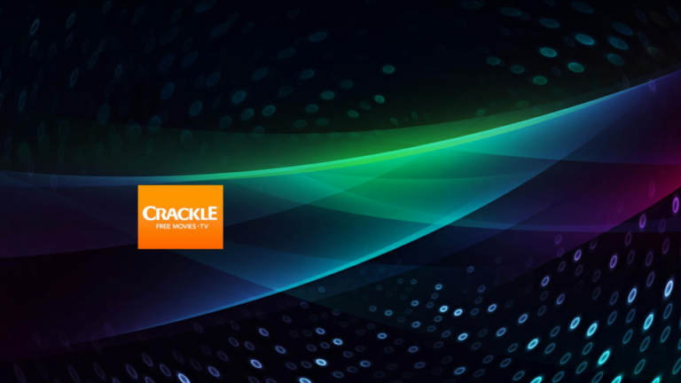

_Entertain your viewers with custom screensavers_


## Overview

Screensavers are simply channels designed to be customizable display screens that can be played in the background. Screensavers use the same features as any other channel to design a UI; all they require is a different entry point from the `main()`. With the release of OS 7.2, screensavers can now be created in SceneGraph for flexible and customizable UIs and animations.

## Types

### Public Screensavers

Similarly to traditional BrightScript screensavers, SceneGraph screensavers will also use the `RunScreenSaver` entry point with the option of including a `RunUserInterface` or `Main()` function. Screensavers that implement a `RunUserInterface` function also have the option to launch from the Home Screen in addition to the screensavers menu.

### Private Screensavers

Private screensavers are only displayed within a specific channel. These are commonly seen in music channels that want to use screensavers to show album cover art for songs playing. Screensavers can be made private by creating an entry named “screensaver_private” in the manifest file of its current channel. **_Note:_ **Private screensavers will not appear in the screensavers menu and will override the current screensaver being used when the channel is running. **Constraints:**

1.  SceneGraph based screensavers **cannot** play video
2.  SceneGraph based screensavers **can** play audio
3.  SceneGraph based screensavers **cannot** execute Channel Store APIs

## Screensaver Entry Points

When launching screensavers from the screensaver menu, the `RunScreenSaver` function will be called and it will run as a normal screensaver. When launching screensavers from the home screen, the `RunUserInterface` function will be called and it will behave as a normal channel allowing the use of any Brightscript or SceneGraph components and user input. Optionally, a `RunScreenSaverSettings` function can be used to modify settings such as colors, fonts, etc. The settings option will be displayed under the preview option in the screensavers menu.



## Creating a Screensaver

**BrightScript (Main.brs)** When creating a screensaver with SceneGraph, we will be using the `roSGScreen` component. This will allow us to draw straight to the scene with nodes that we create in our XML file. We start off by creating these components in our main BrightScript file.

    screen = CreateObject(“roSGScreen”)

When creating screensavers in the `RunUserInterface` function, a message port can be used to observe events from the SceneGraph XML. This is useful for triggering responses from the screensaver based off events from the SceneGraph XML.

```brightscript
    m.port = CreateObject(“roMessagePort”)
    screen.setMessagePort(m.port)

    glb = screen.getGlobalNode()
    glb.AddField(“MyField”, “int”, true)
    glb.MyField = 100

    Scene = screen.createScene(“screensaver”)
    screen.show()
```

Implementing a while loop will also help keep track of data from screensavers. It’s also useful for continuously changing fields such as observers that constantly receive events to progress animations, color changes, background switches, etc.

```brightscript
    while(true)
    Msg = wait(2000,m.port)
    If (msg <> invalid)
    If msgType = “roSGScreenEvent”
    If msg.isScreenClosed() then
    Return
    End if
    else
    glb.MyField - glb.MyField + 10
    End if
    End while
```

The `MyField` function can also have an observer from the `init()` function that will be called everytime the field changes:

    m.global.observeField(“MyField”, “changeBackGroundImage”)

## Initialization

One of the first items to run when a channel is launched is the `init()` function. This function can be used to call other functions, set backgrounds, and establish event listeners in SceneGraph. This BrightScript function can be embedded in SceneGraph using a `<script>` tag to access other fields in SceneGraph.

```brightscript
function init()
m.animationNode = m.top.findNode(“SceneAnimation”)
	 	m.top.backgroundURI = “pkg:/images/background.jpg”
	 	slideRectangle()
end function
```


## Animations

It’s also possible to create animations in screensavers using animation nodes. Simply create the node that you want to animate and then use an animation node to modify its behavior.

```xml
<Rectangle id="Box"
	   color="0x0000FFFF"
	   width="500"
	   height="400"
	   translation="[300, 150]"
>
<Label text="Screensaver Example" horizAlign="center" vertAlign="center" width="300" height="200" color="0x200000FF"/>
</Rectangle>

<Animation id="SceneAnimation" repeat="true" duration="10" easeFunction="linear" >
<Vector2DFieldInterpolator id="AnimInterp"
key = “[0,1]”
keyValue = “[[0,0],[500,500]]”
FieldToInterp = “Box.translation”
	/>
</Animation>
```

 This is just one example of using SceneGraph to design a layout for screensavers. Follow the link below to find different examples of what can be done with screensavers.

**Additional Resources**
* Documentation on entry points and private screensavers: https://sdkdocs.roku.com/display/sdkdoc/Screensavers
* Sample code for additional example screensaver apps: https://roku.app.box.com/s/zrs06qiz4ss4gs2bwt02pbi3cn5us1i4

**Note:** Special thanks and credit to Jason Benjamin for the artwork used in these screensaver examples. **Jason** (<a href="https://www.instagram.com/perfecthue/">@PerfectHue</a>) is based in Los Angeles and is focused on crafting motion graphics, Virtual Reality, and interactive design experiences. You can find his body of work at <a href="http://www.perfecthue.com/">perfecthue.com</a>
