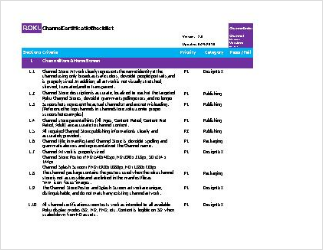

In order to assure the overall quality of the Roku Platform, all public channels in the Roku Channel Store must first be reviewed for quality, design, and performance criteria before being published. This certification process also ensures that new additions to the Channel Store properly integrate our latest platform initiatives.

## Preparing for certification
To minimize the duration of the certification process, developers should download and review our [Pre-certification Checklist](https://sdkdocs.roku.com/download/attachments/3737121/Roku-Channel-Certification-Checklist_v2.0.xlsx?version=8&modificationDate=1467219288542&api=v2) before submitting their channels. The checklist includes the complete list of issues we check for during reviews, as well as a list of every Roku device name and model number we’ve ever released.

### [Download the Pre-certification Checklist](https://sdkdocs.roku.com/download/attachments/3737121/Roku-Channel-Certification-Checklist_v2.0.xlsx?version=8&modificationDate=1467219288542&api=v2)

> :information_source: Note: We are constantly updating the checklist, so be sure to always check the latest copy for new requirements before submitting a channel.

### QA test channels before submitting

Due to the high volume of channels submitted to the Roku Platform daily, our certification process can not and does not replace a developer’s own responsibility to rigorously test their channels for bugs. Developers are expected to use this [Pre-certification Checklist](https://sdkdocs.roku.com/download/attachments/3737121/Roku-Channel-Certification-Checklist_v2.0.xlsx?version=8&modificationDate=1467219288542&api=v2) as a tool to guide their own internal quality assurance testing before submitting their channels for review.

### Testing via private channels

Many developers chose to first publish their channels as private channels before submitting to be a certified public channel. Private channels are not subject to the same review criteria as public channels, and all in-channel transactions using the Roku Billing Services are treated as $0.00 transactions. This makes private channels an ideal "staging area" to beta and QA test a channel before making it publicly available and searchable in the Roku Channel Store.

### Testing across multiple devices

Developers must also be sure to test their channels on multiple types of Roku devices before submitting. Higher-end Roku players have greater processing power and increased memory, so what works on a newer device may be need to be degraded for models with lesser capabilities.
When receiving feedback from viewers on a private channel, be sure to ask for their device model number. Use the “Device List” sheet in the [Pre-certification Checklist](https://sdkdocs.roku.com/download/attachments/3737121/Roku-Channel-Certification-Checklist_v2.0.xlsx?version=8&modificationDate=1467219288542&api=v2) to group feedback by model type.

## Submitting your channel

Once you’ve finished QA testing your channel, you can begin the certification process by submitting your channel package via the “My Channels” section of the Developer Home page. For a step-by-step guide on submitting a channel, read our [Publishing Guide](https://github.com/rokudev/docs/blob/master/publish/channel-store/publishing.md).

> :information_source: Note: Don’t forget to include account credentials if they are necessary to properly review your channel.

## Certification feedback and publishing

Channels are reviewed in the order they were received; your channel will be added to the certification queue immediately upon submission. Developers should expect to receive feedback on their channel within a week of submitting their package.

Channels that pass certification will immediately be published to the Channel Store and the developer will be notified. If you do not want your channel published until a specific date, it must be noted in the “Key Dates” section of the submission form. If a channel does not pass certification, the developer will receive a list of bugs that must be resolved before the channel can be published.

Once a channel is published, it will be visible in the “New” category of the Channel Store for 30 days. This is often one of the best times to grow an audience of viewers, so we recommend coordinating your marketing around this 30 day window.
