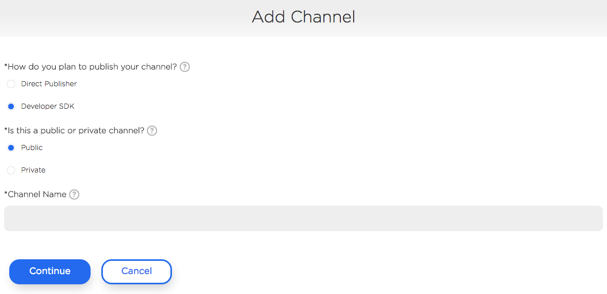
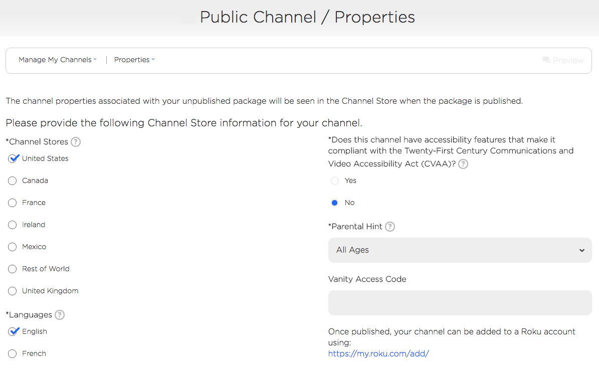
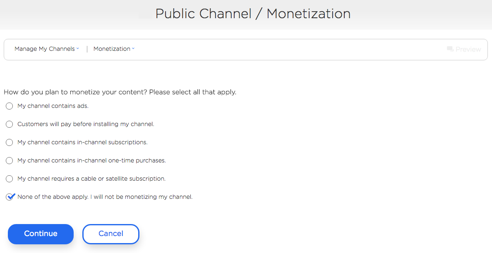
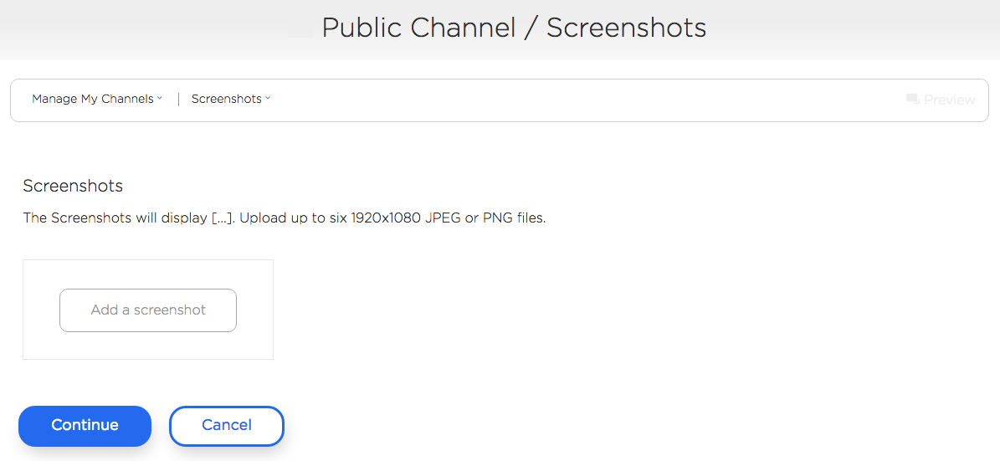
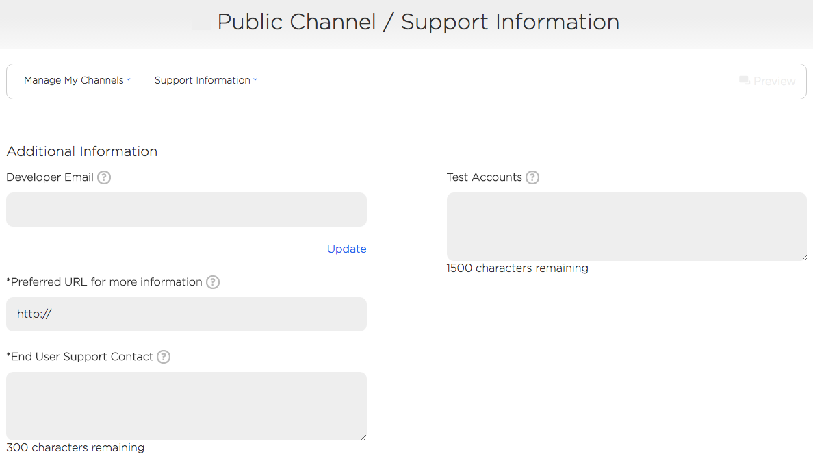
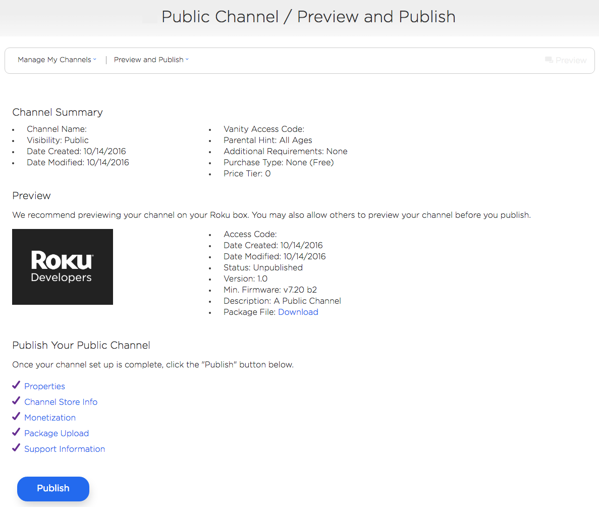
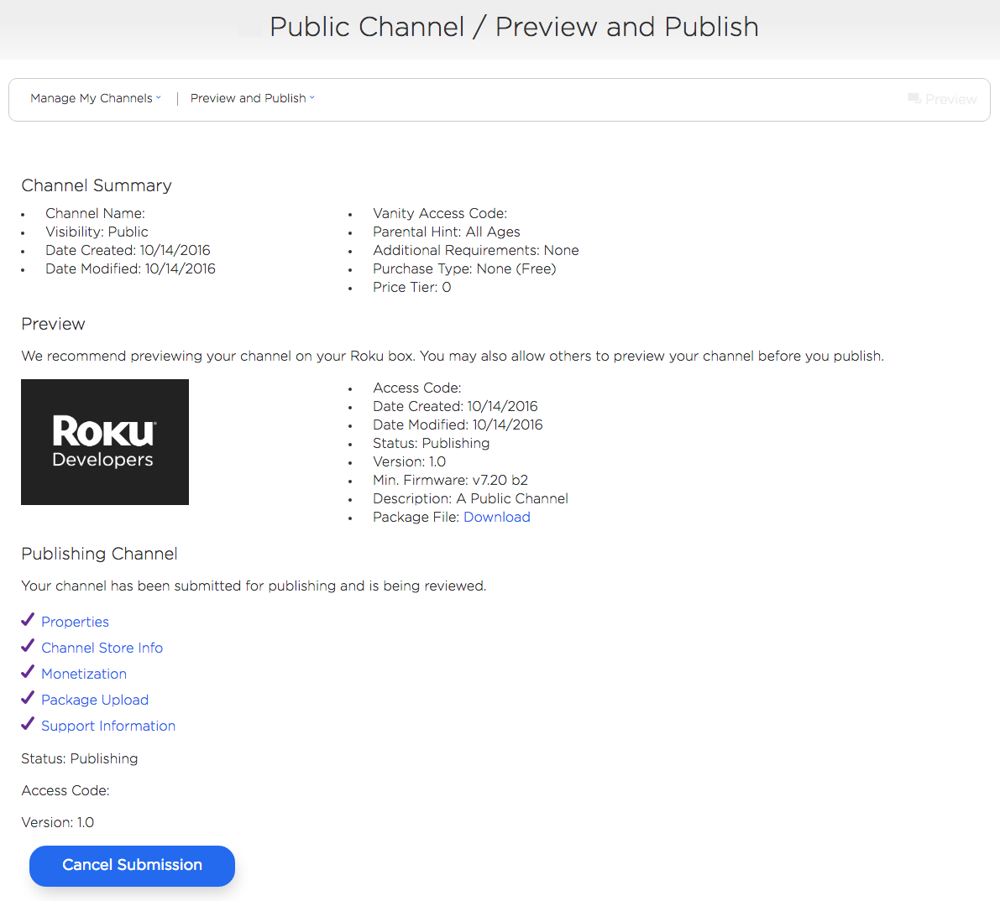
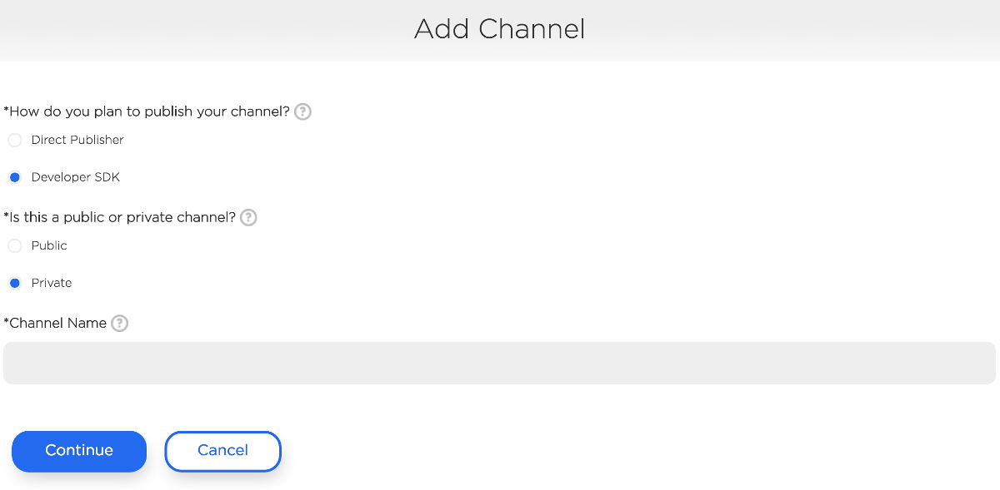
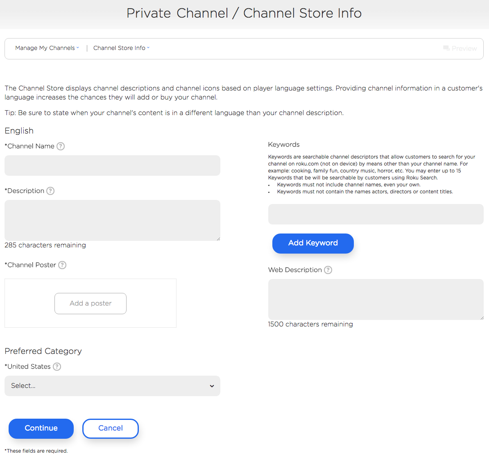

# Publishing Channels

## Overview

Once a Roku channel has been designed, developed and thoroughly tested - the final step is publishing on the Roku platform. The following guide goes over the channel distribution models available on the Roku platform and how to:

* [Create a public channel](#create-a-public-channel)
* [Create a private channel](#create-a-private-channel)
* [Update an existing channel](#update-an-existing-channel)

### Public channels

Channels in the Roku Channel Store are certified before they are made available to the public.
Some of the key benefits for public channels are:

* Featured in the New category for 30 days after publication
* Displayed in a Channel Store category (chosen during the submission process)
* Searchable by channel name in Roku Search

Channels with deep linking and have submitted a Roku Search feed can also support:

* Home screen banner promotions1
* Roku Search by content or person(s)

### Private channels

Private channels are another way to distribute channels on the Roku platform. They are not listed in the Channel Store and can only be installed using the channel access and/or vanity code(s). Private channels are not subject to the channel certification process. The main uses for private channels are:

* Testing Roku-billed in-channel transactions (all purchases are treated as test transactions)2
* QA and beta testing

1 Contact [advertising@roku.com]() for more details.

2 Before enrolling in Roku Billing Services

---

## Create a public channel

On the **[Developer Dashboard](https://developer.roku.com/developer)**, select **[Manage My Channels](https://developer.roku.com/apps)** and **Add Channel** on the following page.

Next, select **Developer SDK**, **Public**, and enter a **Channel Name**.

### Properties

Fill out the following properties:

* **Channel Stores**: regions the channel will be available in
* **Languages**: Languages to localize the Channel Store poster, descriptions and screenshots for
* **Required Features**:
 * USB Support: Select this only if the channel requires a Roku with a USB port to function
 * Screensaver: Select this only if the channel is/contains a screensaver
 * Roku Game Remote: Select this only if the channel requires a remote with A & B buttons to function
* **Classification**: Select the option that best describes the channel type
* **Internet Connection Required**: Yes/No
* **CVAA Compliance**: Yes/No
* **Parental Hint**: Select the best rating for the content in the channel. If unsure, select Content Not Rated.
* **Vanity Access Code**: Add a unique string of characters to make sharing the channel easier (ex. https://my.roku.com/add/myrokuchannel). The Vanity access code is only available after a channel has been published.

### Channel Store Info

On the **Channel Store Info** page, edit:

* description(s)
* preferred Channel Store category for each region

and upload the Channel Store Poster (540x405).

> :information_source: If multiple languages were selected on the Channel Properties page, the Channel Descriptions page will have a separate section for each language for locale-specific descriptions and Channel Store icons.

### Monetization

On the **Monetization** page, select how you plan to monetize your channel. If your channel contains ads, it must use the [Roku Ad Framework](/develop/guides/roku-ad-framework.md).

> :information_source: Monetizing via ads requires enrollment in Roku Billing Services as you'll receive a revenue share from ads backfilled by Roku.

If **Customers will pay before installing my channel** is selected and you’ve enrolled in [Roku Billing Services](developer.roku.com/enrollment/billing), the **Pricing** section will be presented below.

In this section, the type of pay-to-install model (one-time, monthly subscription or yearly subscription) and a corresponding price tier can be selected.

### Screenshots

On the next page, upload any screenshots for display in the Channel Store. Up to 6 FHD (1920x1080) images can be uploaded for each locale.

> :information_source: Refer to the [Screenshots](/develop/developer-tools/developer-settings.md#screenshot-utility) section under [Developer Settings](/develop/developer-tools/developer-settings.md) for instructions on taking channel screenshots.

Once the screenshots have been uploaded, select `Continue`.

### Support Information

Fill out the required contact and support information and any test accounts as needed for Roku to review your submission.

### Package Upload

On the **Package Upload** page, select:

* Channel Version
* Minimum firmware version required to run the channel
* Application Package: Select signed package for publication

and then click `Continue`.

### Preview and Publish

Before selecting `Publish` to submit for Roku [certification review](/publish/channel-store/certification.md), you can select the `access code` to add the channel to your device and also make sure it has been thoroughly tested and reviewed against the **[pre-certification channel checklist](https://sdkdocs.roku.com/download/attachments/3737121/Roku-Channel-Certification-Checklist_v2.0.xlsx?version=8&modificationDate=1467219288542&api=v2)**.

### Submission Survey

When ready, select `Publish` and fill in any **Release Notes** and **Key Dates** as necessary.

Select `Continue` to complete your submission and return to the **Preview and Publish** page.

Once the channel has been submitted, it will be reviewed by Roku and:

* published if it has passed certification
* or you will receive a list of issues that need to be addressed before publication

## Create a private channel

On the [**Developer Dashboard**](https://developer.roku.com/developer), select [**Manage My Channels**](https://developer.roku.com/developer-channels/channels) and **Add Channel** on the following page.

Next, select **Developer SDK**, **Private**, and enter a **Channel Name**.

#### Properties

On the properties page, all the default values selected will be fine to use but you can adjust as needed.

#### Channel Store Info

Edit the channel's description as needed, upload a Channel Store poster (540x405), and select a preferred category.

#### Monetization

On the Monetization page, select how you plan to monetize your channel.

#### Package Upload

 **Upload** your signed package and click **Continue**.

#### Preview and Publish

On the Preview and Publish page, select **Publish** at the bottom.

## Update an existing channel

Updating a channel follows many of the same steps as submitting a new channel. On the **[Developer Dashboard](https://developer.roku.com/developer)**, select **[Manage My Channels](https://developer.roku.com/developer-channels/channels)** and select the channel that needs to be updated.

If none of the Properties or Channel Store Info needs to be updated, click on **Package Upload** to submit a new version.

On the **Package Upload** page, select:

* Channel Version
* Minimum firmware required to run the channel
* Application Package: Select signed package for publication

and then click on `Continue`.

> :information_source: Be sure to increment the channel’s major, minor, and build versions in the manifest as well as the `Channel Version` on this page for each new package submitted.

**Public channels**: Click `Update` to display the **Submission Survey** page.

Select `Continue` to finalize the submission and return to the **Preview and Publish** page. As with first time submissions, public channel updates will be reviewed by Roku and:

* published if it has passed certification
* or you will receive a list of issues that need to be addressed before publication

> :information_source: Private channels do not go through Roku certification review and can be auto-published if it does not use pay-to-install Roku Billing.
