# Publishing Channels

## Overview

Once a Roku channel has been designed, developed and thoroughly tested - the final step is publishing on the Roku platform. The following guide goes over the channel distribution models available on the Roku platform and how to:

* [Create a public channel](#create-a-public-channel)
* [Create a private channel](#create-a-private-channel)
* [Update an existing channel](#update-an-existing-channel)

### Public channels

Channels in the Roku Channel Store are certified before they are made available to the public.
Some of the key benefits for public channels are:

* Featured in the New category for 30 days after publication
* Displayed in a Channel Store category (chosen during the submission process)
* Searchable by channel name in Roku Search

Channels with deep linking and have submitted a Roku Search feed can also support:

* Home screen banner promotions1
* Roku Search by content or person(s)

### Private channels

Private channels are another way to distribute channels on the Roku platform. They are not listed in the Channel Store and can only be installed using the channel access and/or vanity code(s). Private channels are not subject to the channel certification process. The main uses for private channels are:

* Testing Roku-billed in-channel transactions (all purchases are treated as test transactions)2
* QA and beta testing

1 Contact [advertising@roku.com]() for more details.

2 Before enrolling in Roku Billing Services

---

## Create a public channel

On the **[Developer Dashboard](https://developer.roku.com/developer)**, select **[Manage My Channels](https://developer.roku.com/apps)** and **[Add Public Channel](https://developer.roku.com/apps/create/public)** on the following page.

### Channel Properties

On the **Channel Properties** page, select any monetization models that apply and click `Continue`.

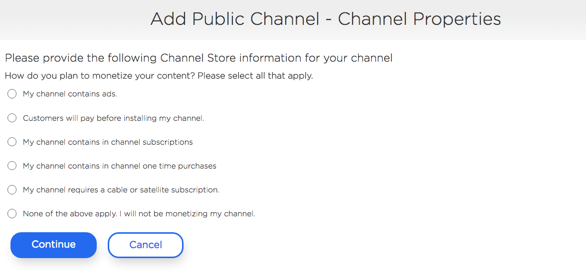

Fill out the channel properties:

* **Channel Stores**: regions the channel will be available in
* **Languages**: Languages to localize the Channel Store icons, descriptions and screenshots for
* **Required Features**:
 * USB Support: Select this only if the channel requires a Roku with a USB port to function
 * Screensaver: Select this only if the channel is/contains a screensaver
 * Roku Game Remote: Select this only if the channel requires a remote with A & B buttons to function
* **Classification**: Select the option that best describes the channel type
* **Internet Connection Required**: Yes/No
* **Parental Hint**: Select the best rating for the content in the channel. If unsure, select Content Not Rated.
* **Vanity Access Code**: Add a unique string of characters to make sharing the channel easier (ex. https://my.roku.com/add/myrokuchannel). The Vanity access code is only available after a channel has been published.

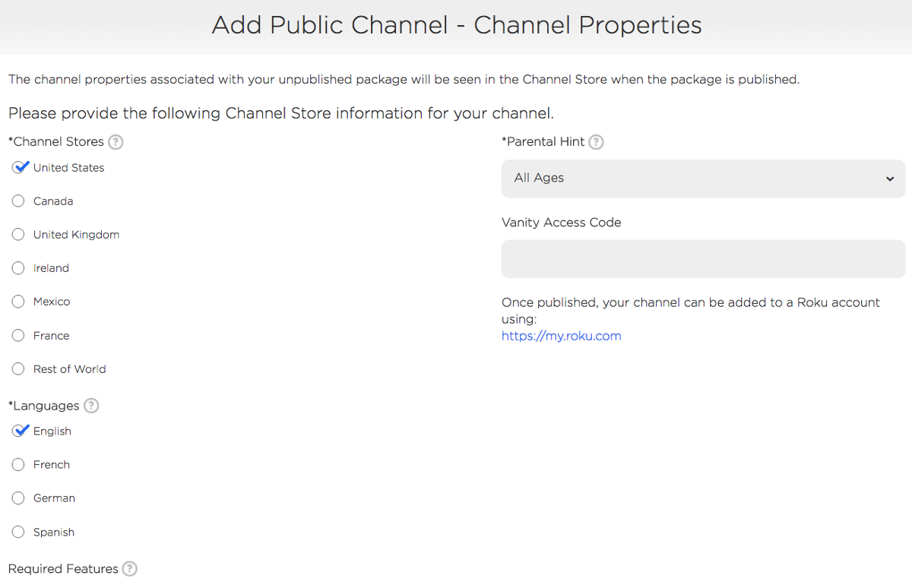

### Channel Pricing / pay-to-install

If **Customers will pay before installing my channel** was selected on the monetization questionnaire and you’ve enrolled in Roku Billing Services, the **Channel Pricing** page will be presented.

On this page, the type of pay-to-install model (one-time, monthly subscription or yearly subscription) and a corresponding price tier can be selected.

### Channel Descriptions

On the **Channel Descriptions** page, fill in:

* name of the channel
* descriptions
* keywords for channelstore.roku.com
* preferred Channel Store categories

and upload the Channel Store icons.

_Note: If multiple languages were selected on the Channel Properties page, the Channel Descriptions page will have a separate section for each language for locale-specific descriptions and Channel Store icons._

### Screenshots

On the next page, upload any screenshots for display in the Channel Store. Up to 6 HD (1280x720) and 6 FHD (1920x1080) images can be uploaded for each locale.

Refer to the [Screenshots](/develop/developer-tools/developer-settings.md#screenshot-utility) section under [Developer Settings](/develop/developer-tools/developer-settings.md) for instructions on taking channel screenshots.

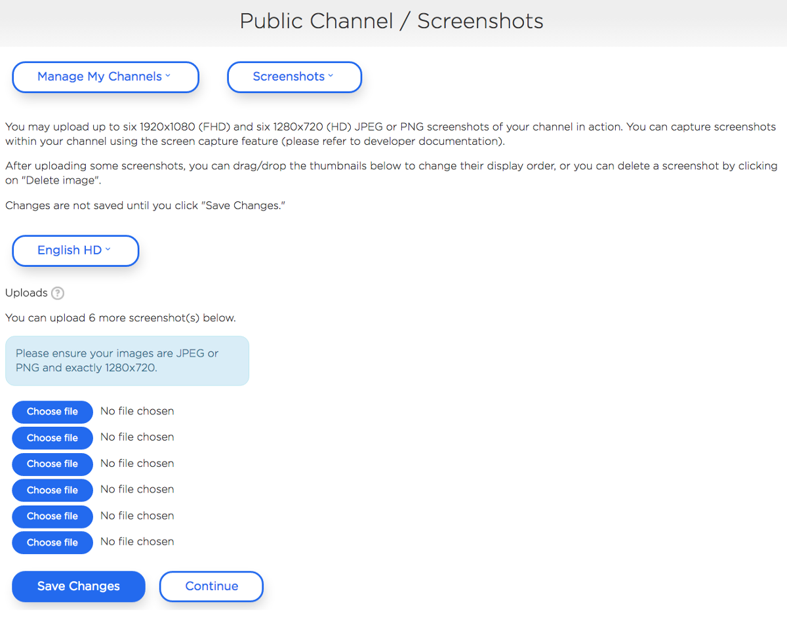

Once the screenshots have been uploaded, select `Continue`.

### Support Information

Before we proceed with the package submission, click on **Support Information** and fill in all required fields.

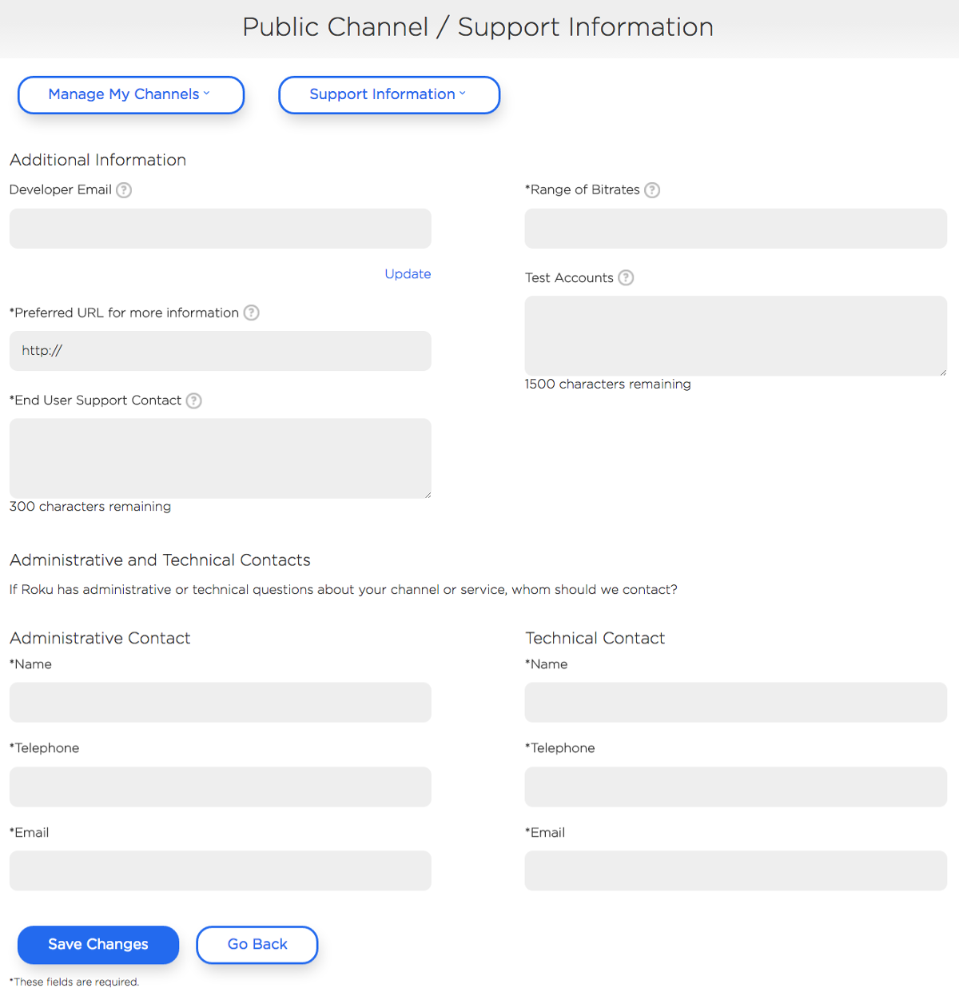

### Package Submission

On the **Package Submission** page, select:

* Channel Version
* Minimum firmware version required to run the channel
* Application Package: Select signed package for publication

and then click on `Save Changes`.

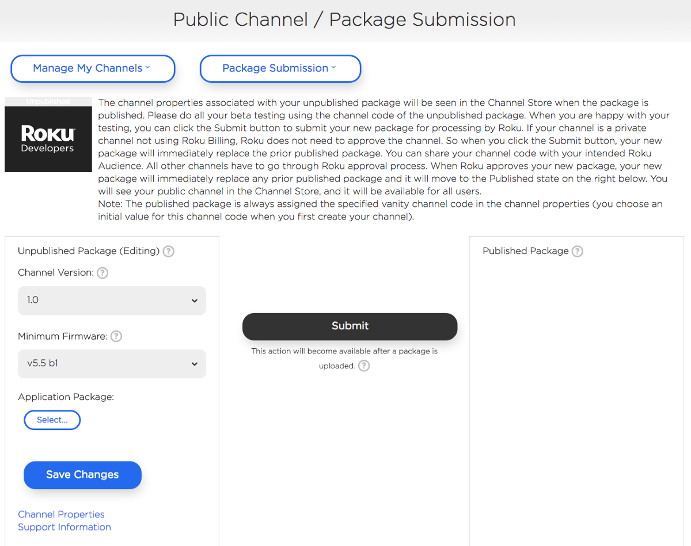

After the package has been uploaded, there should now be an **Access Code** available and the `Submit` button should also be selectable.

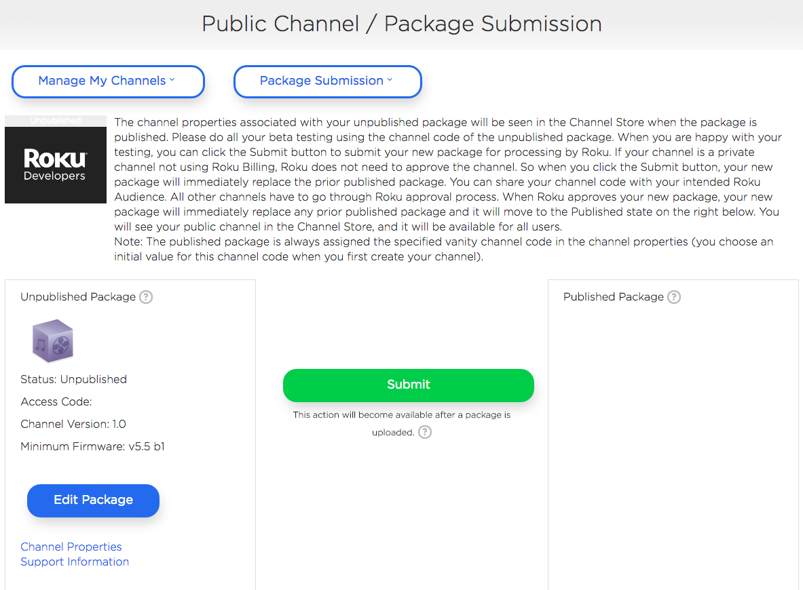

Before submitting, make sure the channel has been thoroughly tested and reviewed against the **[pre-certification channel checklist](https://sdkdocs.roku.com/download/attachments/3737121/Roku-Channel-Certification-Checklist_v2.0.xlsx?version=8&modificationDate=1467219288542&api=v2)**.

### Key Dates
Click `Submit` and fill in any key publishing dates.

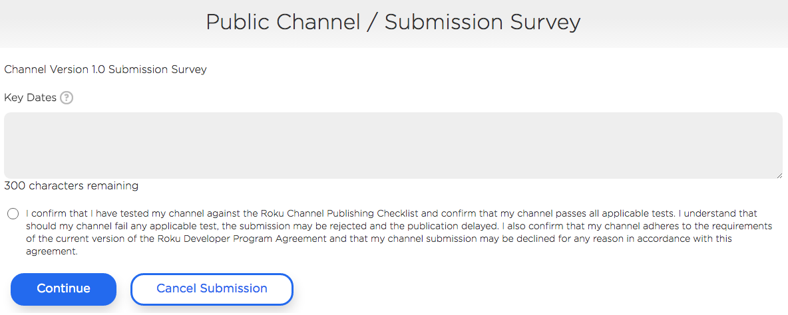

Select `Continue` to return to the **Package Submission** page.

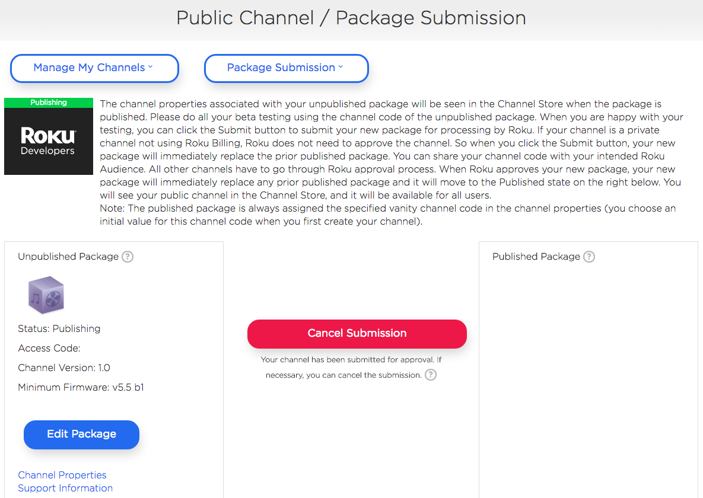

Once the channel has been submitted, it will be reviewed by Roku and:

* published if it has passed certification
* or receive a list of issues that need to be addressed before publication

## Create a private channel
On the **[Developer Dashboard](https://developer.roku.com/developer)**, select **[Manage My Channels](https://developer.roku.com/apps)** and **[Add Private Channel](https://developer.roku.com/apps/create/private)** on the following page.

Likewise with public channels, select the monetization method(s).

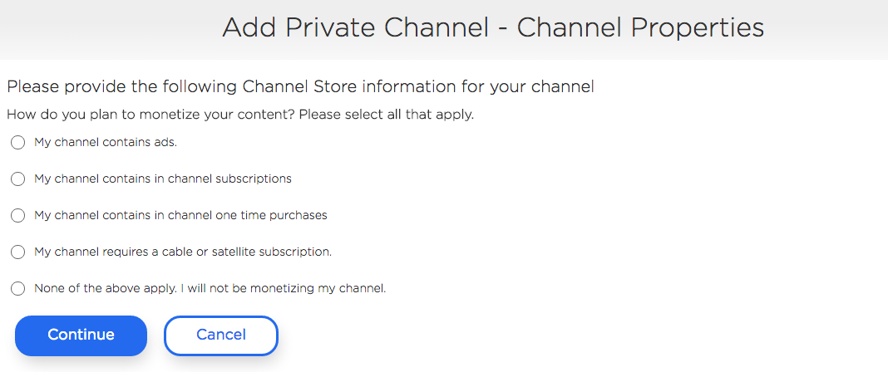

Fill out the channel properties, descriptions and Channel Store icons as needed.

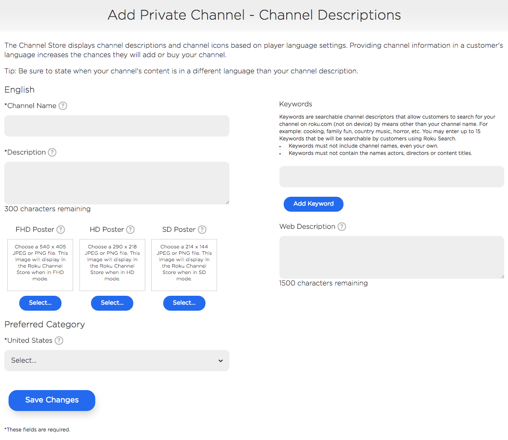

_Note: Screenshots can be omitted for private channels._

On the screenshots page, click `Continue`. On the **Package Submission** page, `Select` the signed package for publication and click on `Save Changes`.

After the package has been uploaded, there should now be an **Access Code** available and the `Submit` button should also be selectable.

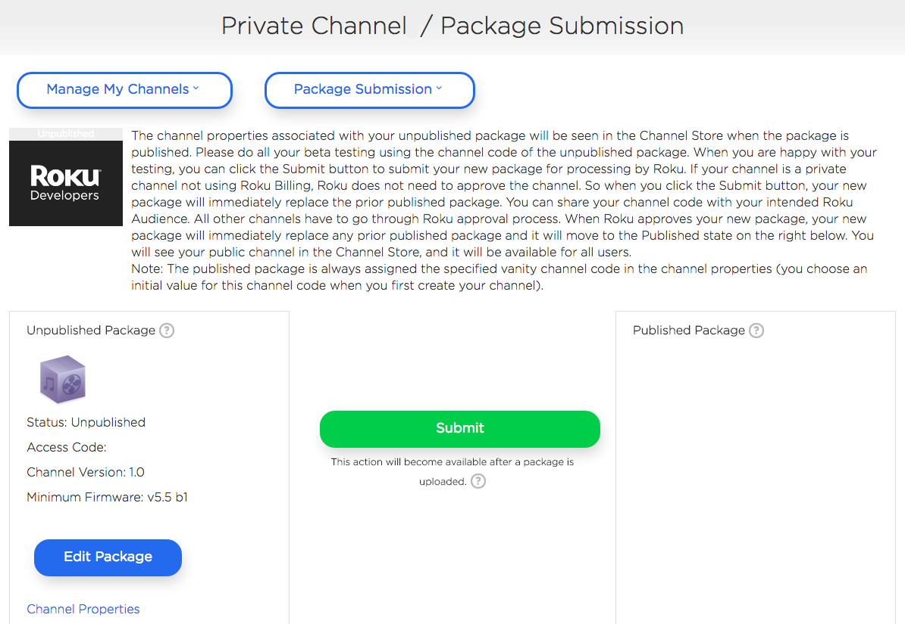

Select `Submit` to successfully publish the channel.

The package details will be shown on the right and the status will update to Published.

## Update an existing channel

Updating a channel follows many of the same steps as submitting a new channel. On the **[Developer Dashboard](https://developer.roku.com/developer)**, select **[Manage My Channels](https://developer.roku.com/apps)** and select the channel that needs to be updated.

If none of the Channel Properties or Descriptions need to be updated, click on **Edit Channel** to go directly to the **Package Submission** page.

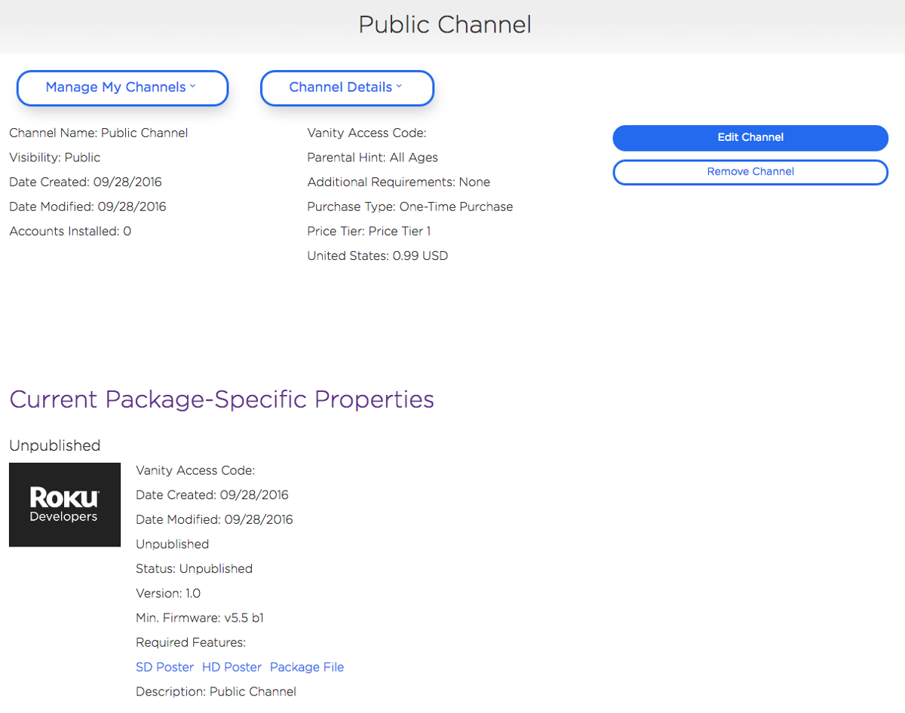

On the **Package Submission** page, select:

* Channel Version
* Minimum firmware required to run the channel
* Application Package: Select signed package for publication

and then click on `Save Changes`.

_Note: Be sure to increment the channel’s major, minor, and build versions in the manifest as well as on the Roku Developer Portal for each package submitted._

**Public channels**: Click `Submit` to display the **Key Dates** page. In addition, there is also a section for **Release Notes**. Being as detailed as possible will help with the certification process.

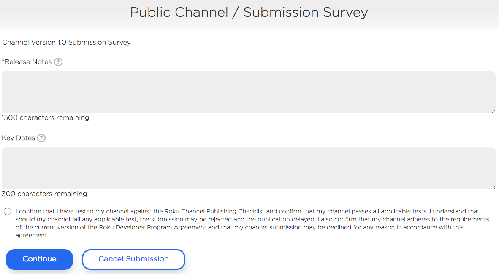

Select `Continue` to finalize the submission and return to the **Package Submission** page. As with first time submissions, public channel updates will be reviewed by Roku and:

* published if it has passed certification
* or receive a list of issues that need to be addressed before publication

Private channels do not go through Roku certification and can be auto-published if it does not use pay-to-install Roku Billing.
